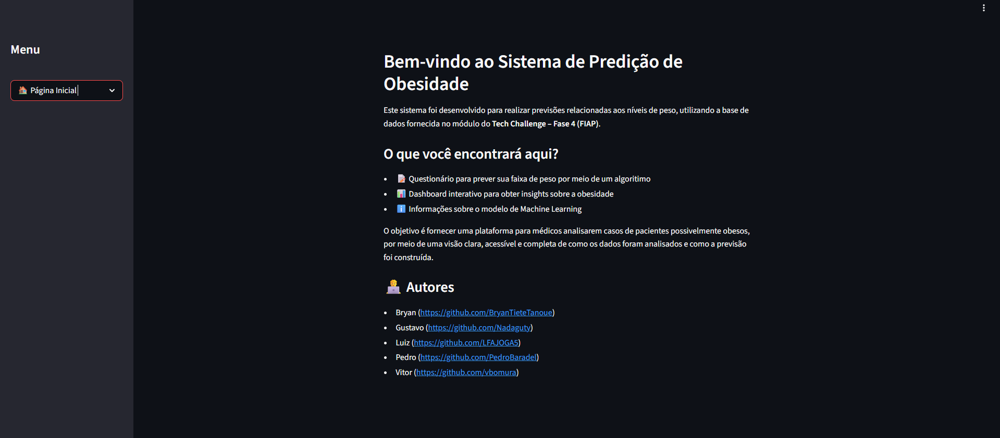
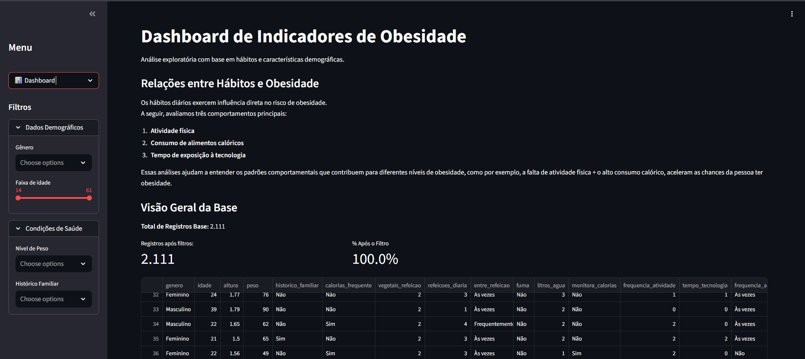
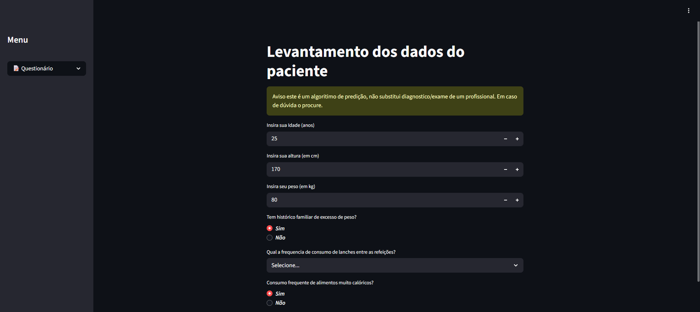

# 📊 Tech Challenge – Fase 4
### Dashboard e Previsão de Obesidade com Machine Learning
**FIAP – Pós-Graduação em Inteligência Artificial**

---

> Aplicação completa de Machine Learning para análise e predição de níveis de obesidade, desenvolvida com Streamlit e modelos supervisionados de classificação.

🔗 **Acesse a aplicação:** [tc4final-9oedbhdg7nvpzhwtmtrnyr.streamlit.app](https://tc4final-9oedbhdg7nvpzhwtmtrnyr.streamlit.app/)

---

## 📋 Índice

- [Sobre o Projeto](#-sobre-o-projeto)
- [Funcionalidades](#️-funcionalidades)
- [Screenshots](#-screenshots)
- [Machine Learning](#-machine-learning)
- [Estrutura do Projeto](#-estrutura-do-projeto)
- [Como Executar](#-como-executar)
- [Dependências](#-dependências)
- [Autores](#-autores)

---

## 📌 Sobre o Projeto

Este projeto foi desenvolvido como parte do **Tech Challenge da FIAP – Fase 4**, com o objetivo de construir uma solução completa de Machine Learning aplicada à saúde pública.

A aplicação permite que qualquer usuário, sem conhecimento técnico, preencha informações sobre seus hábitos e condições físicas e receba uma **predição do seu nível de obesidade** com base em um modelo treinado e validado.

O projeto cobre todas as etapas do ciclo de vida de um projeto de ML:

- Análise exploratória dos dados (EDA)
- Pré-processamento e feature engineering
- Comparação e seleção de modelos
- Deploy da solução em interface web interativa

---

## 🖥️ Funcionalidades

### 🔍 Pesquisa de Obesidade
Coleta de informações pessoais e de hábitos do usuário por meio de um formulário intuitivo, com retorno imediato da predição do modelo.

### 📊 Dashboard de Análises
Visualizações interativas com distribuições, correlações e insights extraídos durante a análise exploratória dos dados.

### ℹ️ Sobre o Projeto
Explicações sobre a metodologia utilizada, o modelo escolhido e informações gerais da solução.

---

## 📸 Screenshots

### Tela Inicial


### Dashboard de Análises


### Pesquisa – Formulário de Predição


> 💡 *Substitua as imagens acima pelos screenshots reais do app nas pastas indicadas.*

---

## 🧠 Machine Learning

### Dataset
O dataset utilizado contém variáveis relacionadas a hábitos alimentares, atividade física, histórico familiar e características físicas dos indivíduos.

### Pré-processamento
- Tratamento de valores ausentes
- Encoding de variáveis categóricas
- Normalização e padronização de variáveis numéricas
- Pipeline scikit-learn para reprodutibilidade

### Modelos Avaliados

| Modelo | Acurácia | Observação |
|---|---|---|
| Regressão Logística | — | Baseline |
| Decision Tree | — | Interpretável, mas com overfitting |
| **Random Forest** | **—** | ✅ **Modelo escolhido** |

### Métricas de Avaliação
- Acurácia
- Precision
- Recall
- F1-Score
- Matriz de Confusão

### Modelo Final
O **Random Forest** foi selecionado por apresentar o melhor equilíbrio entre acurácia, generalização e robustez contra overfitting. O modelo treinado está salvo em `tools/RandomForest.joblib`.

> Para detalhes completos da análise, consulte o notebook em `MachineLearning/Algoritmo.ipynb`.

---

## 📁 Estrutura do Projeto

```
fiap_obesity_predictor_dash/
│
├── MachineLearning/
│   └── Algoritmo.ipynb         # Análise exploratória, pré-processamento e comparação de modelos
│
├── assets/
│   └── grafico.png             # Imagens auxiliares
│
├── modules/
│   ├── dashboard.py            # Página de insights e visualizações
│   ├── pesquisa.py             # Formulário de predição
│   └── imagem.py               # Informações sobre o modelo
│
├── tools/
│   ├── RandomForest.joblib     # Modelo treinado serializado
│   └── utils.py                # Funções auxiliares e pipeline
│
├── main.py                     # Entrada da aplicação Streamlit
├── requirements.txt            # Dependências do projeto
└── README.md
```

---

## ▶️ Como Executar Localmente

**Pré-requisitos:** Python 3.8+

```bash
# 1. Clone o repositório
git clone https://github.com/PedroBaradel/fiap_obesity_predictor_dash.git
cd fiap_obesity_predictor_dash

# 2. Instale as dependências
pip install -r requirements.txt

# 3. Execute a aplicação
streamlit run main.py
```

A aplicação estará disponível em `http://localhost:8501`.

---

## 📦 Dependências

As dependências estão listadas em `requirements.txt`. As principais bibliotecas utilizadas são:

| Biblioteca | Finalidade |
|---|---|
| Streamlit | Interface web interativa |
| scikit-learn | Modelos e pipeline de ML |
| pandas / numpy | Manipulação de dados |
| plotly / matplotlib | Visualizações |
| joblib | Serialização do modelo |

---

## 👨‍💻 Autores

Desenvolvido por alunos da **FIAP – Pós-Graduação em Inteligência Artificial**:

| Nome | GitHub |
|---|---|
| Bryan | [@BryanTieteTanoue](https://github.com/BryanTieteTanoue) |
| Gustavo | [@Nadaguty](https://github.com/Nadaguty) |
| Luiz | [@LFAJOGA5](https://github.com/LFAJOGA5) |
| Pedro | [@PedroBaradel](https://github.com/PedroBaradel) |
| Vitor | [@vbomura](https://github.com/vbomura) |

---

<p align="center">Desenvolvido com 💙 como parte do programa de pós-graduação da FIAP</p>
